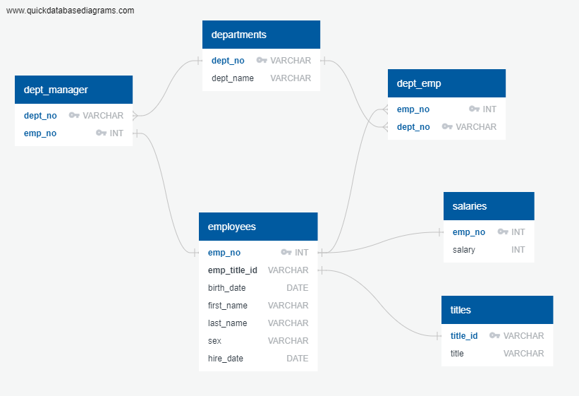

# MODULE 9 - SQL-CHALLENGE

For the challenge we were tasked to do a research project about people employed at the Pewlett Hackard during the 1980s and 1990s. A database was created and six CSV files containing company data were entered into tables so that a quarry analysis could be performed.  
Files submitted for this project include:
*EmployeeSQL ERD PNG file– Outlining to schema of the EmployeeSQL database.
*EmployeeSQL table schemata SQL Source File – Used to crease the db tables, establish primary, foreign keys and table constraints.
*EmployeeSQL queries SQL Source File – Code to perform queries on db
*README Markdown Source File – Used to outline sql-challenge project and  EmployeeSQL database design and queries conducted

## Data Modeling

EmployeeSQL ERD was created using QuickDBD at https://www.quickdatabasediagrams.com.  The tables were designed through the QuickDBD database creation environment and the results were exported as a PNG Image outlining the design structure and as a PostgreSQL file that was then imported into PostgreSQL.  

## Data Engineering

The exported SQL file from QuickDBD was import into PostgreSQL and the resulting schema code was used to create the tables and constraints of the SQL-CHALLENGE database.  Data from the six CSV flies were then uploaded into the database tables and db constrains were established for analysis.  
## Data Analysis

For the Data Analysis portion of the project the resulting db was queried eight times to acquire the data requested by Pewlett Hackard.  These queried included:
*List the employee number, last name, first name, sex, and salary of each employee.
*List the first name, last name, and hire date for the employees who were hired in 1986.
* List the manager of each department along with their department number, department name, employee number, last name, and first name.
*List the department number for each employee along with that employee’s employee number, last name, first name, and department name.
*List first name, last name, and sex of each employee whose first name is Hercules and whose last name begins with the letter B.
*List each employee in the Sales department, including their employee number, last name, and first name.
*List each employee in the Sales and Development departments, including their employee number, last name, first name, and department name.
*List the frequency counts, in descending order, of all the employee’s last names.

All the requested queries were able to be run with no errors and the appropriate data results were able to be acquired.

